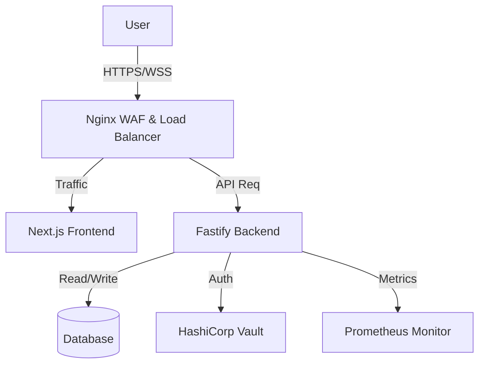

<div align="center">
  <h1>The Transcendence</h1>
  <h3>The Ultimate Ping Pong Platform 🏓</h3>
</div>


> **"Not just a game. A lesson in secure, scalable, real-time architecture."**

## 🚀 Overview
**ft_transcendence** is a feature-rich, real-time multiplayer Pong platform. But under the hood, it's a showcase of modern DevOps and Secure Software Development Life Cycle (SSDLC) practices.

Built with a microservices-inspired architecture, it leverages **Next.js** for a responsive frontend, **Fastify** for a high-performance backend, and **HashiCorp Vault** for enterprise-grade secret management. This isn't just a coding exercise; it's a simulation of a production-ready environment.

---

## ✨ Key Features & "The Why"
_Why this stack? Because performance and security matter._

- **🛡️ Enterprise Security (Vault):** Unlike typical student projects that store secrets in `.env` files, this project uses **HashiCorp Vault** to manage secrets dynamically. This mimics real-world banking and enterprise security standards.
- **⚡ Real-Time Performance:** Utilizes WebSockets for low-latency gameplay, ensuring a smooth competitive experience.
- **🐋 Containerized Infrastructure:** Fully Dockerized environment ensuring consistency from development to production. `make up` is all you need.
- **🔐 Two-Factor Authentication (2FA):** Implements industry-standard TOTP 2FA for robust user account security.
- **📊 Interactive Dashboard:** dynamic visualizations of user stats and match history.

---

## 🏗️ Architecture

This project follows a separation of concerns principle, dividing the application into distinct, containerized services:



### Tech Stack
| Component | Technology | Reasoning |
|-----------|------------|-----------|
| **Frontend** | Next.js 15, Framer Motion | SSR for SEO and performance; Motion for premium feel. |
| **Backend** | Fastify (Node.js) | Low overhead, high throughput API handling. |
| **Database** | PostgreSQL / SQLite | Relational data integrity for match history. |
| **Security** | HashiCorp Vault | Centralized secret management (No hardcoded keys!). |
| **DevOps** | Docker Compose, Makefile | 1-command deployment and environment isolation. |

---

## 📸 Visual Showcase
<!--*(Add your GIFs here! Recruiter Tip: People watch videos more than they read code.)*-->

### � Live Demonstrations
| **Remote Game** | **Tournament Mode** |
|:------------------:|:-------------------:|
|  |  |

| **Interactive Dashboard** | **Real-Time Chat** |
|:------------------:|:-------------------:|
|  |  |

| **Secure Auth Flow (2FA)** | **Grafana Monitoring** |
|:------------------:|:-------------------:|
|  |  |

### �🎮 Gameplay & Matchmaking
| **Remote Match Launcher** | **Tournament Launcher** |
|:------------------:|:-------------------:|
|  |  |

| **Local Launcher** | **Matches History** |
|:------------------:|:-------------------:|
|  |  |

### 👤 User Profile & Settings
| **User Profile** | **Account Settings** |
|:------------------:|:-------------------:|
|  |  |

### 🔐 Authentication
| **Login Page** | **Registration** |
|:------------------:|:-------------------:|
|  |  |

### 💬 Social & Features
| **Live Chat** | **Dashboard (Main)** |
|:------------------:|:-------------------:|
|  |  |

### 🌍 Internationalization & Accessibility
| **Dashboard (Arabic)** | **Dashboard (French)** |
|:------------------:|:-------------------:|
|  |  |

| **High Contrast Mode** | **Dark Mode** |
|:------------------:|:-------------------:|
|  |  |

---

## 🛠️ Getting Started
We believe in "Infrastructure as Code". You don't need to configure 10 files to run this.

### Prerequisites
- Docker & Docker Compose
- Make

### Installation
1. **Clone the repository**
   ```bash
   git clone git@github.com:salahrachidi/The-transcendence.git
   cd ft_transcendence
   ```

2. **Launch the Infrastructure**
   ```bash
   make up
   ```
   *This command orchestrates the frontend, backend, database, and Vault containers automatically.*

3. **Access the App**
   Open [https://localhost](https://localhost) in your browser. (Accept the self-signed certificate, part of our HTTPS setup).

---

## 💡 Challenges Solved
- **Immersive Arcade UI:** Crafted a custom Glassmorphism/Neon design language using **TailwindCSS**, **Framer Motion**, and **Lucide Icons** to enhance user immersion to the Arcade game vibe.
- **The "Cookie" Dilemma:** Solving `SameSite=Strict` policies while handling cross-container communication.
- **Secret Zero:** Bootstrapping Vault securely without hardcoding the initial unseal tokens in the application code.
- **State Synchronization:** Handling race conditions in real-time game logic using optimistic UI updates.

---

## 📬 Contact
**Mehdi El Akary** - AI/ML & DevOps Enthusiast
[LinkedIn](https://www.linkedin.com/in/elakarymehdi/) | [GitHub](https://github.com/callmemehdy)

**Salaheddine rachidi** - Full-Stack & Robotics & AI/ML Enthusiast
[LinkedIn](https://www.linkedin.com/in/rachidi1/) | [GitHub](https://github.com/salahrachidi)

**mohamed elhoudaigui** - AI/ML & Backend Enthusiast
[LinkedIn](https://www.linkedin.com/in/mohamed-el-houdaigui-4389a6385/) | [GitHub](https://github.com/mohamedelhoudaigui)

**Anas El Ammari** - CyberSecurity & AI/ML Enthusiast
[LinkedIn](https://www.linkedin.com/in/anas-ri/) | [GitHub](https://github.com/gitraiden)
