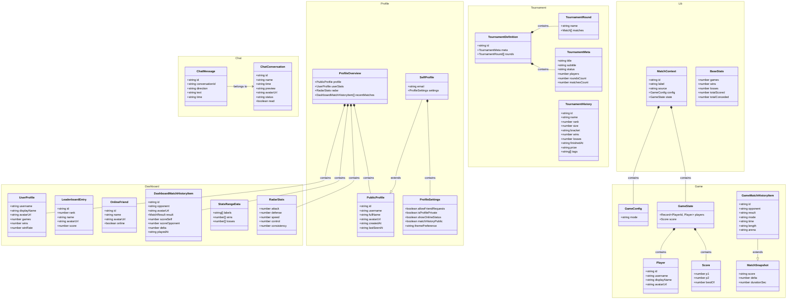

# UML Class Diagram

This diagram represents the data models and their relationships across the `frontend/app` directory.

```mermaid
classDiagram
    %% ==========================================
    %% DASHBOARD PACKAGE
    %% ==========================================
    namespace Dashboard {
        class UserProfile {
            +string username
            +string displayName
            +string avatarUrl
            +number games
            +number wins
            +number winRate
        }
        class LeaderboardEntry {
            +string id
            +number rank
            +string name
            +string avatarUrl
            +number score
        }
        class OnlineFriend {
            +string id
            +string name
            +string avatarUrl
            +boolean online
        }
        class DashboardMatchHistoryItem {
            +string id
            +string opponent
            +string avatarUrl
            +MatchResult result
            +number scoreSelf
            +number scoreOpponent
            +number delta
            +string playedAt
        }
        class StatsRangeData {
            +string[] labels
            +number[] wins
            +number[] losses
        }
        class RadarStats {
            +number attack
            +number defense
            +number speed
            +number control
            +number consistency
        }
    }

    %% ==========================================
    %% CHAT PACKAGE
    %% ==========================================
    namespace Chat {
        class ChatConversation {
            +string id
            +string name
            +string time
            +string preview
            +string avatarUrl
            +string status
            +boolean read
        }
        class ChatMessage {
            +string id
            +string conversationId
            +string direction
            +string text
            +string time
        }
    }

    %% ==========================================
    %% PROFILE PACKAGE
    %% ==========================================
    namespace Profile {
        class PublicProfile {
            +string id
            +string username
            +string fullName
            +string avatarUrl
            +string createdAt
            +string lastSeenAt
        }
        class ProfileSettings {
            +boolean allowFriendRequests
            +boolean isProfilePrivate
            +boolean showOnlineStatus
            +boolean matchHistoryPublic
            +string themePreference
        }
        class SelfProfile {
            +string email
            +ProfileSettings settings
        }
        class ProfileOverview {
            +PublicProfile profile
            +UserProfile userStats
            +RadarStats radar
            +DashboardMatchHistoryItem[] recentMatches
        }
    }

    %% ==========================================
    %% GAME PACKAGE
    %% ==========================================
    namespace Game {
        class Player {
            +string id
            +string username
            +string displayName
            +string avatarUrl
        }
        class Score {
            +number p1
            +number p2
            +number bestOf
        }
        class GameConfig {
            +string mode
        }
        class GameState {
            +Record~PlayerId, Player~ players
            +Score score
        }
        class MatchSnapshot {
            +string score
            +number delta
            +number durationSec
        }
        class GameMatchHistoryItem {
            +string id
            +string opponent
            +string result
            +string mode
            +string time
            +string length
            +string arena
        }
    }

    %% ==========================================
    %% TOURNAMENT PACKAGE
    %% ==========================================
    namespace Tournament {
        class TournamentRound {
            +string name
            +Match[] matches
        }
        class TournamentMeta {
            +string title
            +string subtitle
            +string status
            +number players
            +number roundsCount
            +number matchesCount
        }
        class TournamentDefinition {
            +string id
            +TournamentMeta meta
            +TournamentRound[] rounds
        }
        class TournamentHistory {
            +string id
            +string name
            +number rank
            +number size
            +string bracket
            +number wins
            +number losses
            +string finishedAt
            +string prize
            +string[] tags
        }
    }

    %% ==========================================
    %% LIB PACKAGE
    %% ==========================================
    namespace Lib {
        class MatchContext {
            +string id
            +string label
            +string source
            +GameConfig config
            +GameState state
        }
        class BaseStats {
            +number games
            +number wins
            +number losses
            +number totalScored
            +number totalConceded
        }
    }

    %% RELATIONSHIPS
    SelfProfile --|> PublicProfile : extends
    SelfProfile *-- ProfileSettings : contains
    ProfileOverview *-- PublicProfile : contains
    ProfileOverview *-- UserProfile : contains
    ProfileOverview *-- RadarStats : contains
    ProfileOverview *-- DashboardMatchHistoryItem : contains

    GameMatchHistoryItem --|> MatchSnapshot : extends
    GameState *-- Player : contains
    GameState *-- Score : contains

    TournamentDefinition *-- TournamentMeta : contains
    TournamentDefinition *-- TournamentRound : contains

    MatchContext *-- GameConfig : contains
    MatchContext *-- GameState : contains

    ChatMessage --> ChatConversation : belongs to
```
